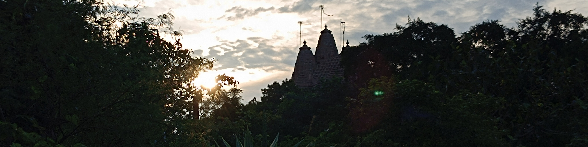

</img>
<h1 align="center">Hi 👋, I'm Vinod Mali</h1>
<h3 align="left">I am a passionate web developer with a keen interest in learning new programming languages and technologies. Currently, I am expanding my skill set by diving into C++ and mastering Data Structures and Algorithms (DSA). Beyond web development, I have a strong fascination with space exploration and drone technology. I am always eager to explore how these fields can intersect and innovate. Whether I am coding a new website, developing software, or experimenting with drones, I am driven by curiosity and a love for technology.
 
 

  

- 🌱 I’m currently learning **DSA with C++**

- 💬 Ask me about **DSA, HTML, CSS, JavaScript**

<h3 align="left">Connect with me:</h3>

<h3 align="left">Languages and Tools:</h3>

     

